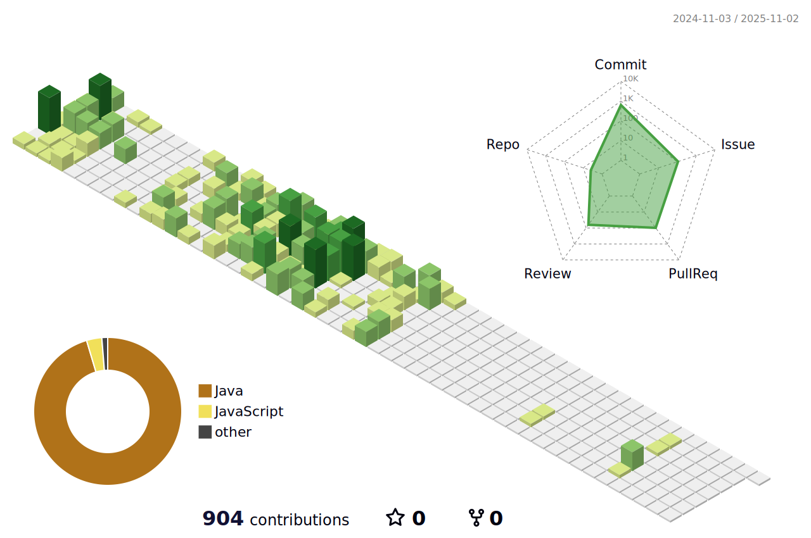

<!--타이틀 부분-->

  

<!--내용 부분-->
<h3 align="center">✨ Tech Stack ✨</h3>

  &nbsp
  &nbsp
  &nbsp

  &nbsp
  &nbsp

 

  &nbsp
  &nbsp
  &nbsp
  &nbsp

 

<h3 align="center">📚 Studying 📚</h3>

  &nbsp
  &nbsp

 

<h3 align="center">🛠 Tools 🛠</h3>

  &nbsp
  &nbsp
  &nbsp

  &nbsp
  &nbsp

<h3 align="center">📫 Contact 📫</h3>

  <a href="fnsl102626@gmail.com">
    &nbsp
  </a>
</div
